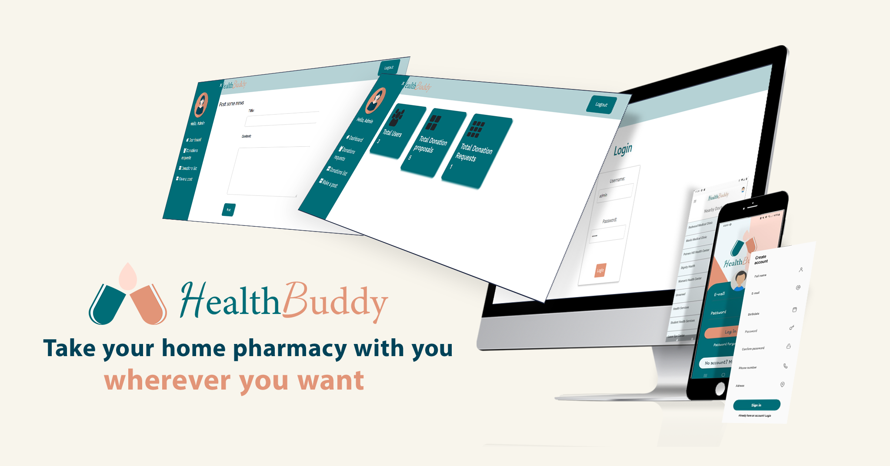

<!-- LOGO -->
 

  

<h3 align="center">HealthBuddy</h3>

  

    This is  a Java android application to manage the user's home pharmacy.
  

    

<!-- TABLE OF CONTENTS -->

  
Table of Contents

  <ol>
    <li>
      <a href="#about-the-project">About The Project</a>
      <ul>
        <li><a href="#built-with">Built With</a></li>
      </ul>
    </li>
    <li>
      <a href="#getting-started">Getting Started</a>
      <ul>
        <li><a href="#prerequisites">Prerequisites</a></li>
        <li><a href="#installation">Installation</a></li>
      </ul>
    </li>
    <li><a href="#contact">Contact</a></li>
  </ol>

<!-- ABOUT THE PROJECT -->
## About The Project

It's destinated to organise the medicine, prescriptions and analyses at home while having the ability to make appointments reminders and alerts of medicine expiration dates or the time to take medicine.📲💊

The project is divided into two parts:

📱 Mobile Part: Using Android Studio (Java), I've created a user-friendly interface allowing individuals to effectively manage their medicine inventory, analyses, prescriptions, and reminders. Additionally, they can easily locate nearby doctors and pharmacies. One of the standout features of this application is its barcode scanning capability for medicines, along with the option to donate or request donated medicine. The user can  manage up to two patients and have their own dashboard of prescriptions, analyses and appointment reminders.

💻 Web Part: The administrator of the application can leverage the power of HTML/CSS/JavaScript and the Ajax method to manage various aspects. This includes posting news updates visible to all users and overseeing the donations and requests made by users through the mobile app.

(<a href="#readme-top">back to top</a>)

### Built With

            

(<a href="#readme-top">back to top</a>)

